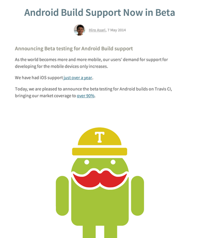

# いまさらTravis-CI


dagezi@{twitter, github, gmail.com}


## 自己紹介
SASAKI Takesi (佐々木毅史)
aka dagezi (大个子)

教育関係の会社で Androidエンジニアやってます。

- Potatotips5: [強制アップデートさせる話](http://dagezi.github.io/potatotips5/)
- IT Pro: [ベネッセと小学生用タブレットで実験した](http://itpro.nikkeibp.co.jp/article/COLUMN/20140430/553923/)
- Edtech CTO Night: [2014年版フロントエンド開発の当たり前](https://speakerdeck.com/fujimura/2014nian-ban-hurontoendokai-fa-falseatarimae-at-edtech-cto-night)


## 仕事では Hybrid Appliction

- Coffescript + WebView 
- 終わる運命の WebSQL (でも Jerrybeanじゃ..)
- WebViewでも WebViewと感じさせない反応！

という話は人気なさそうなのでよします。


## CIやってるひといますか？

- Jenkins
- [Travis-CI](https://travis-ci.org/)
- [Wercker](http://wercker.com/)


## Androidが Travis CIの一級市民に！

[Androidサポートがβ版に！](http://blog.travis-ci.com/2014-05-07-android-build-support-now-in-beta/)




## 対応法
すごく簡単！

[Building an Android Project (beta)](http://docs.travis-ci.com/user/languages/android/)

```
language: android
```

- すでにいろんな Versionの platformが準備されてる！
- Maven, Gradle, Antを自動判別！


## まだできてないこと

自動エミュレータ起動。まだ wait_for_emulator がいる。

[rxjava-android-example](https://github.com/andrewhr/rxjava-android-example/blob/master/.travis.yml)

```
language: android
env:
  matrix:
    - ANDROID_SDKS=android-19,sysimg-19  ANDROID_TARGET=android-19  ANDROID_ABI=armeabi-v7a
before_install:
  - echo no | android create avd --force -n test -t $ANDROID_TARGET --abi $ANDROID_ABI
  - emulator -avd test -no-skin -no-audio -no-window &
before_script:
  - ./ci/wait_for_emulator
  - adb shell input keyevent 82 &
```


## これだけ！

予想以上に簡単だった。
自分のプロジェクトも 10分ぐらいで対応できた。


